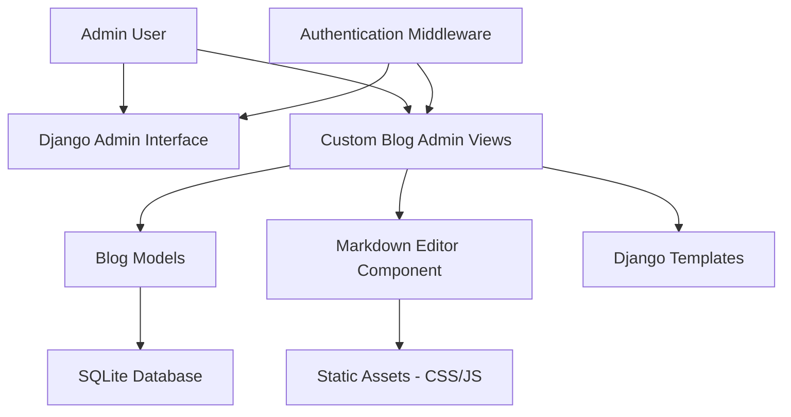

# Design Document

## Overview

The blog admin system will be built as a Django application that extends the existing tutorial-saas project. The system will provide a complete content management interface for blog posts with CRUD operations, markdown editing capabilities, and a modern responsive UI. The design leverages Django's built-in admin authentication system and extends it with custom views for enhanced blog management.

## Architecture

### High-Level Architecture



### Technology Stack

- **Backend Framework**: Django 5.0 (existing)
- **Database**: SQLite (existing db.sqlite3)
- **Frontend**: Django Templates with modern CSS/JavaScript
- **Markdown Editor**: CodeMirror or SimpleMDE
- **CSS Framework**: Bootstrap 5 or Tailwind CSS for responsive design
- **Authentication**: Django's built-in authentication system

## Components and Interfaces

### 1. Blog Models

#### Blog Post Model
```python
class BlogPost(models.Model):
    title = models.CharField(max_length=200)
    slug = models.SlugField(unique=True)
    content = models.TextField()  # Markdown content
    excerpt = models.TextField(blank=True)  # Auto-generated or manual
    status = models.CharField(choices=[('draft', 'Draft'), ('published', 'Published')])
    created_at = models.DateTimeField(auto_now_add=True)
    updated_at = models.DateTimeField(auto_now=True)
    author = models.ForeignKey(User, on_delete=CASCADE)
```

#### Category Model (Optional Enhancement)
```python
class Category(models.Model):
    name = models.CharField(max_length=100)
    slug = models.SlugField(unique=True)
    description = models.TextField(blank=True)
```

### 2. View Layer Architecture

#### Class-Based Views Structure
- **BlogListView**: Display paginated list of blog posts
- **BlogCreateView**: Handle blog post creation with markdown editor
- **BlogUpdateView**: Handle blog post editing
- **BlogDeleteView**: Handle blog post deletion with confirmation
- **BlogDetailView**: Display individual blog post (admin preview)

#### URL Structure
```
/admin/blog/                    # Blog list view
/admin/blog/create/             # Create new blog post
/admin/blog/<slug>/             # View blog post detail
/admin/blog/<slug>/edit/        # Edit blog post
/admin/blog/<slug>/delete/      # Delete blog post confirmation
```

### 3. Frontend Components

#### Markdown Editor Integration
- **Editor Component**: CodeMirror-based markdown editor with syntax highlighting
- **Preview Pane**: Real-time markdown rendering
- **Toolbar**: Common formatting buttons (bold, italic, headers, links, images)
- **File Upload**: Image upload functionality with drag-and-drop

#### UI Components
- **Navigation**: Admin sidebar with blog management links
- **Data Tables**: Sortable, filterable blog post listings
- **Modal Dialogs**: Confirmation dialogs for delete operations
- **Form Validation**: Client-side and server-side validation feedback

## Data Models

### Database Schema

```sql
-- Blog Posts Table
CREATE TABLE blog_blogpost (
    id INTEGER PRIMARY KEY AUTOINCREMENT,
    title VARCHAR(200) NOT NULL,
    slug VARCHAR(50) UNIQUE NOT NULL,
    content TEXT NOT NULL,
    excerpt TEXT,
    status VARCHAR(20) DEFAULT 'draft',
    created_at DATETIME NOT NULL,
    updated_at DATETIME NOT NULL,
    author_id INTEGER NOT NULL,
    FOREIGN KEY (author_id) REFERENCES auth_user (id)
);

-- Categories Table (Optional)
CREATE TABLE blog_category (
    id INTEGER PRIMARY KEY AUTOINCREMENT,
    name VARCHAR(100) NOT NULL,
    slug VARCHAR(50) UNIQUE NOT NULL,
    description TEXT
);

-- Many-to-Many relationship (Optional)
CREATE TABLE blog_blogpost_categories (
    id INTEGER PRIMARY KEY AUTOINCREMENT,
    blogpost_id INTEGER NOT NULL,
    category_id INTEGER NOT NULL,
    FOREIGN KEY (blogpost_id) REFERENCES blog_blogpost (id),
    FOREIGN KEY (category_id) REFERENCES blog_category (id)
);
```

### Data Flow

1. **Create Flow**: Admin → Form Validation → Model Save → Database → Redirect
2. **Read Flow**: Database → Model Query → Template Rendering → Response
3. **Update Flow**: Database → Form Population → Validation → Model Update → Database
4. **Delete Flow**: Confirmation → Model Delete → Database → Redirect

## Error Handling

### Validation Strategy

#### Model-Level Validation
- Title length and uniqueness validation
- Slug generation and uniqueness enforcement
- Content presence validation
- Status field choices validation

#### Form-Level Validation
- Client-side validation for immediate feedback
- Server-side validation for security
- Custom validation for markdown content
- File upload validation (size, type, security)

#### Error Response Handling
- **400 Bad Request**: Invalid form data with field-specific errors
- **403 Forbidden**: Unauthorized access attempts
- **404 Not Found**: Non-existent blog posts
- **500 Server Error**: Database or system errors with user-friendly messages

### Error Recovery
- Auto-save functionality for draft content
- Form data persistence on validation errors
- Graceful degradation for JavaScript failures
- Database transaction rollback on failures

## Testing Strategy

### Unit Testing
- **Model Tests**: Validation, save/update operations, relationships
- **View Tests**: HTTP responses, authentication, authorization
- **Form Tests**: Validation logic, data processing
- **Utility Tests**: Slug generation, markdown processing

### Integration Testing
- **CRUD Workflow Tests**: Complete create/read/update/delete cycles
- **Authentication Tests**: Login/logout, permission enforcement
- **File Upload Tests**: Image upload and processing
- **Database Tests**: Data integrity, constraint enforcement

### Frontend Testing
- **JavaScript Tests**: Editor functionality, form validation
- **UI Tests**: Responsive design, cross-browser compatibility
- **Accessibility Tests**: Screen reader compatibility, keyboard navigation
- **Performance Tests**: Page load times, editor responsiveness

### Test Data Strategy
- **Fixtures**: Sample blog posts for consistent testing
- **Factory Pattern**: Dynamic test data generation
- **Mock Objects**: External service dependencies
- **Database Isolation**: Test database separation

## Security Considerations

### Authentication & Authorization
- Django's built-in admin authentication
- Permission-based access control
- Session management and CSRF protection
- Password strength requirements

### Input Validation & Sanitization
- Markdown content sanitization
- XSS prevention in rendered content
- File upload security (type validation, size limits)
- SQL injection prevention through ORM

### Data Protection
- Secure file storage for uploaded images
- Database backup and recovery procedures
- Audit logging for admin actions
- Rate limiting for form submissions

## Performance Optimization

### Database Optimization
- Proper indexing on frequently queried fields
- Query optimization with select_related/prefetch_related
- Database connection pooling
- Pagination for large datasets

### Frontend Optimization
- Static file compression and caching
- Lazy loading for images
- Minified CSS/JavaScript
- CDN integration for static assets

### Caching Strategy
- Template fragment caching
- Database query caching
- Static file caching headers
- Redis integration for session storage (future enhancement)